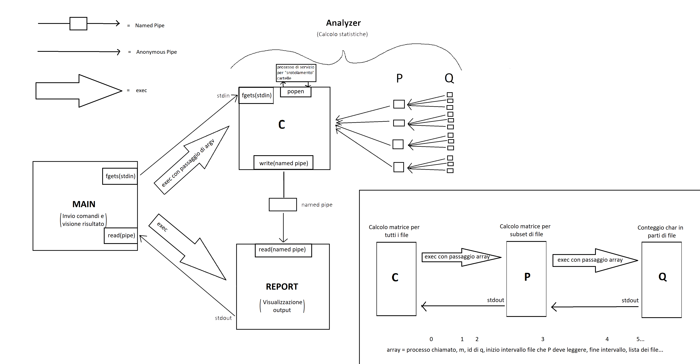

# osproject

Progetto di gruppo per il corso di Sistemi Operativi

### Consegna:

Analisi della frequenza di lettere in file di testo utilizzando pipe per la gestione del flusso di dati fra sottoprocessi concorrenti.

